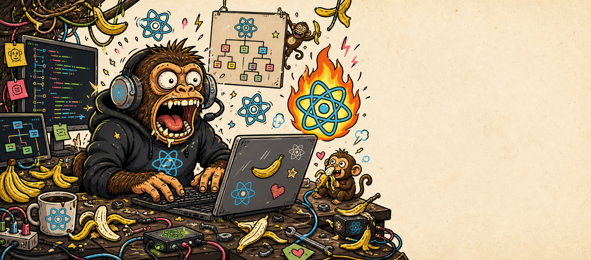

# react-monkey



React implementation specialist with parallel codebase exploration for Claude Code and Codex.

## What it does

The `react-monkey:implement` skill auto-invokes when you work on React components, hooks, or pages (`.tsx`/`.jsx` files). It:

1. Explores your design system, data fetching patterns, and surrounding code before writing a single line
2. Plans the folder structure (folder tree mirrors JSX tree)
3. Implements components following 5 strict architectural rules
4. Runs lint and typecheck using your project's toolchain

## Project-agnostic by design

`react-monkey` is intentionally agnostic and should work across React projects.

The skill owns generic React implementation discipline: component boundaries, folder structure, prop shape, colocated hooks, styling responsibility, and verification flow.

It should not encode app-specific conventions. Put domain rules, APIs, route patterns, entity names, design-system details, package commands, and repository quirks in the target repo's agent instructions instead: `CLAUDE.md`, `AGENTS.md`, README files, or equivalent local docs. `react-monkey` reads those local instructions before implementation and adapts to them.

## The 5 rules

1. **One component per file** — no helper components in the same file
2. **Folder mirrors JSX tree** — file layout = component nesting
3. **IDs-only props** — no domain objects in props; components fetch their own data
4. **Shared data via select hooks** — siblings share a colocated hook, no extra requests
5. **Split large components into subfolders** — max ~80 lines per component

## Runtime layout

```text
react-monkey/
├── claudecode/
│   ├── .claude-plugin/
│   ├── agents/
│   └── skills/
└── codex/
    ├── assets/
    ├── .codex-plugin/
    └── skills/
```

The Claude Code runtime keeps a named `explorer` agent.

The Codex runtime is a native Codex skill. It delegates exploration to Codex's built-in `explorer` subagent when available and falls back to local read-only discovery when subagents are unavailable.

## Claude Code installation

```
/plugin marketplace add g-bastianelli/skill-issue
/plugin install react-monkey
```

## Codex CLI installation

```
$skill-installer install github.com/g-bastianelli/skill-issue/react-monkey/codex
```

Or manually from a local clone:

```bash
mkdir -p ~/.codex/skills
cp -R ./react-monkey/codex ~/.codex/skills/react-monkey
```

## Trigger

Auto-invokes on React component, hook, or page work. Also triggered by `/react-monkey:implement` in Claude Code or `$implement` in Codex.
