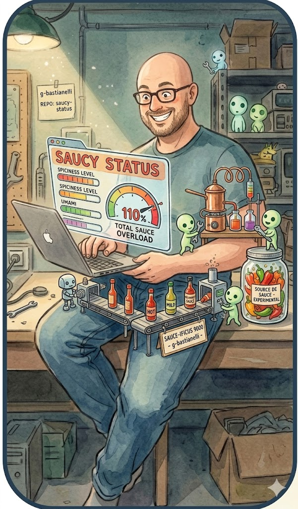

# saucy-status

<p align="center"></p>

> *Claude gooning on your context... it's beautiful*

Claude Code used to show fun thinking labels while processing — `* Gooning... (thought for 4s)`, `* Topsy-turvying...`, `* Brewing...`. Random, chaotic, perfect.

Those labels are gone (or at least, "Gooning" is). This plugin brings the vibe back — two ways:

- **Statusline** — message rotates at the bottom while Claude thinks
- **Conversation** — random message surfaces in the transcript on every prompt

---

## Install

```
/plugin marketplace add g-bastianelli/saucy-status
/plugin install saucy-status@saucy-status
```

Restart Claude Code. Statusline auto-configures. Done.

## Commands

| Command | Effect |
|---------|--------|
| `/saucy on` | Activate saucy mode |
| `/saucy off` | Deactivate |
| `/saucy gooning` | Switch to gooning mode |
| `/saucy status` | Report current mode |
| `/saucy` | Toggle off ↔ saucy |

## Modes

**off** — silent (default)

**saucy** — double entendres, suggestive tech metaphors. Claude is "allocating full RAM for this very special request."

**gooning** — full brainrot. Claude is "lost in your embeddings." Duration unknown.

---

State persists across sessions in `~/.claude/.saucy-status`.

## Uninstall

```
/plugin uninstall saucy-status@saucy-status
rm ~/.claude/.saucy-status
```
